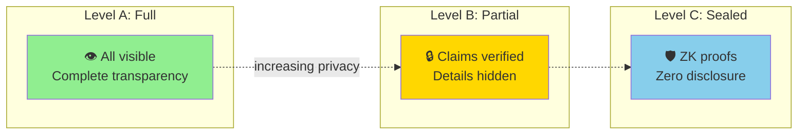

# GenesisGraph: Universal Verifiable Process Provenance

**v0.3.0 — November 2025**

[](https://github.com/scottsen/genesisgraph/actions)
[](https://pypi.org/project/genesisgraph/)
[](https://scottsen.github.io/genesisgraph)
[](LICENSE)

**An open standard for cryptographically proving how things were made.**

GenesisGraph provides verifiable provenance for AI pipelines, manufacturing, scientific research, and any workflow where "prove how you made this" matters. The three-level selective disclosure model (A/B/C) enables proving compliance without revealing trade secrets—solving the "certification vs IP protection" dilemma.

---

## Quick Start

### Installation

```bash
# Python
pip install genesisgraph

# JavaScript/TypeScript
npm install @genesisgraph/sdk

# CLI Tool
pip install genesisgraph[cli]
```

### Your First Provenance Document

```python
from genesisgraph import GenesisGraph, Entity, Operation, Tool

# Create a document
gg = GenesisGraph(spec_version="0.1.0")

# Add a tool
tool = Tool(id="freecad", type="Software", version="0.21.2")
gg.add_tool(tool)

# Add entities
input_file = Entity(id="model.fcstd", type="CADModel", version="1.0",
                   hash="sha256:a1b2...")
output_file = Entity(id="model.stl", type="Mesh3D", version="1.0",
                    hash="sha256:e5f6...", derived_from=["model.fcstd@1.0"])
gg.add_entity(input_file)
gg.add_entity(output_file)

# Record the operation
op = Operation(id="export_stl", type="mesh_export",
              inputs=["model.fcstd@1.0"], outputs=["model.stl@1.0"],
              tool="freecad@0.21.2")
gg.add_operation(op)

# Export provenance
gg.save_yaml("workflow.gg.yaml")
```

**Learn more:** [5-Minute Quickstart](https://scottsen.github.io/genesisgraph/getting-started/quickstart/)

---

## Core Innovation: A/B/C Disclosure Levels



| Level | What You Share | Use When |
|-------|---------------|----------|
| **A: Full** | All details visible | Internal audits, open research |
| **B: Partial** | Policy claims visible, parameters hidden | Regulatory compliance |
| **C: Sealed** | Merkle commitments + TEE attestations | High-value IP, supply chains |

**Example:** Prove ISO 9001 compliance without revealing manufacturing toolpaths, or AI safety compliance without exposing proprietary prompts.

**Learn more:** [Disclosure Levels Guide](https://scottsen.github.io/genesisgraph/user-guide/disclosure-levels/)

---

## Part of the Semantic Infrastructure Lab

**GenesisGraph** is a production component of the [Semantic Infrastructure Lab (SIL)](https://github.com/semantic-infrastructure-lab/sil) — building the semantic substrate for intelligent systems.

**Role in the Semantic OS:**
- **Cross-Cutting:** Provenance infrastructure (enables verifiable transformations across all layers)

**SIL Principles Applied:**
- ✅ **Clarity** — Explicit process representation, no hidden transformations
- ✅ **Simplicity** — Minimal standard (graphs, hashes, signatures)
- ✅ **Composability** — Graphs compose, selective disclosure composes
- ✅ **Correctness** — 666+ tests, cryptographic verification
- ✅ **Verifiability** — Core mission: provable computational correctness

**Quick Links:** [SIL Manifesto](https://github.com/semantic-infrastructure-lab/sil/blob/main/docs/canonical/MANIFESTO.md) • [Unified Architecture](https://github.com/semantic-infrastructure-lab/sil/blob/main/docs/architecture/UNIFIED_ARCHITECTURE_GUIDE.md) • [Project Index](https://github.com/semantic-infrastructure-lab/sil/blob/main/projects/PROJECT_INDEX.md)

---

## 📚 Documentation

**Full documentation:** [scottsen.github.io/genesisgraph](https://scottsen.github.io/genesisgraph)

### Quick Navigation by Role

| Role | Start Here |
|------|------------|
| **👨‍💻 Developers** | [Quickstart](https://scottsen.github.io/genesisgraph/getting-started/quickstart/) → [Examples](https://scottsen.github.io/genesisgraph/getting-started/examples/) → [Architecture](https://scottsen.github.io/genesisgraph/developer-guide/architecture/) |
| **🏢 Decision-Makers** | [FAQ](https://scottsen.github.io/genesisgraph/faq/) → [Use Cases](https://scottsen.github.io/genesisgraph/use-cases/) → [Vision](https://scottsen.github.io/genesisgraph/strategic/vision/) |
| **🤖 AI/ML Engineers** | [Disclosure Levels](https://scottsen.github.io/genesisgraph/user-guide/disclosure-levels/) → [AI Examples](https://scottsen.github.io/genesisgraph/use-cases/#ai-pipelines) → [AI Validators](https://scottsen.github.io/genesisgraph/user-guide/profile-validators/) |
| **🔬 Researchers** | [Specification](https://scottsen.github.io/genesisgraph/specifications/main-spec/) → [Selective Disclosure](https://scottsen.github.io/genesisgraph/user-guide/selective-disclosure/) → [ZKP Templates](https://scottsen.github.io/genesisgraph/specifications/zkp-templates/) |

### Documentation Structure (Progressive Reveal)

1. **[Getting Started](https://scottsen.github.io/genesisgraph/getting-started/quickstart/)** (5-10 min) - Installation, quickstart, examples
2. **[User Guide](https://scottsen.github.io/genesisgraph/user-guide/overview/)** (15-30 min) - Features, disclosure levels, advanced topics
3. **[Developer Guide](https://scottsen.github.io/genesisgraph/developer-guide/architecture/)** (30-60 min) - Architecture, contributing, security
4. **[Strategic Context](https://scottsen.github.io/genesisgraph/strategic/vision/)** (20-45 min) - Vision, roadmap, critical gaps

---

## Features

### Core Functionality
- ✅ Three-level selective disclosure (A/B/C)
- ✅ Cryptographic signatures (Ed25519)
- ✅ Hash verification (SHA256, SHA512, Blake3)
- ✅ Python & JavaScript SDKs
- ✅ CLI tool (`gg` command)

### Advanced Features
- ✅ DID resolution (did:key, did:web, did:ion, did:ethr)
- ✅ Certificate Transparency log integration (RFC 6962)
- ✅ Selective Disclosure JWT (SD-JWT)
- ✅ BBS+ signatures for privacy
- ✅ Zero-knowledge proof templates
- ✅ Profile validators (AI Basic, CAM, ISO 9001, FDA 21 CFR 11)

### Quality Metrics
- 666+ comprehensive tests
- ~76% test coverage (up from 63% in v0.2)
- Production-ready cryptographic features (98%+ coverage)
- CI/CD with GitHub Actions (Python 3.9-3.12)

**See:** [Implementation Status](https://scottsen.github.io/genesisgraph/reference/implementation-summary/) for complete details.

---

## Use Cases

- **AI Pipelines:** Track model training, validate datasets, prove compliance
- **Manufacturing:** CAD provenance, ISO 9001 compliance, supply chain verification
- **Scientific Research:** Reproducible science, data lineage, peer review
- **Healthcare:** Medical data processing chains, HIPAA compliance
- **Supply Chains:** Verify product origins, track transformations

**See:** [Use Cases & Examples](https://scottsen.github.io/genesisgraph/use-cases/)

---

## Roadmap

**Current Version:** v0.3.0 (November 2025)
**Target:** v1.0 Production Release (March 2027)

**Next Milestones:**
- **v0.4.0** (Jan 2026) - 90% test coverage, API docs site, strict typing
- **v0.5.0** (Mar 2026) - Formal threat model, lifecycle & revocation
- **v0.6.0** (May 2026) - Delegation & authorization framework
- **v0.7.0** (Aug 2026) - AI agent provenance

**See:** [Complete Roadmap](https://scottsen.github.io/genesisgraph/strategic/roadmap/)

---

## Contributing

We welcome contributions! Please see our [Contributing Guide](https://scottsen.github.io/genesisgraph/developer-guide/contributing/) for details.

**Quick Links:**
- [Architecture Guide](https://scottsen.github.io/genesisgraph/developer-guide/architecture/)
- [Security Policy](https://scottsen.github.io/genesisgraph/developer-guide/security/)
- [Issue Tracker](https://github.com/scottsen/genesisgraph/issues)
- [Discussions](https://github.com/scottsen/genesisgraph/discussions)

---

## License

- **Specification:** [CC-BY 4.0](https://creativecommons.org/licenses/by/4.0/)
- **Code & SDKs:** [Apache 2.0](LICENSE)

---

## Contact

- **Documentation:** [scottsen.github.io/genesisgraph](https://scottsen.github.io/genesisgraph)
- **Issues:** [github.com/scottsen/genesisgraph/issues](https://github.com/scottsen/genesisgraph/issues)
- **Discussions:** [github.com/scottsen/genesisgraph/discussions](https://github.com/scottsen/genesisgraph/discussions)
- **Security:** See [SECURITY.md](SECURITY.md) for vulnerability reporting

---

**GenesisGraph** — Proving how things were made, without revealing how to make them.
